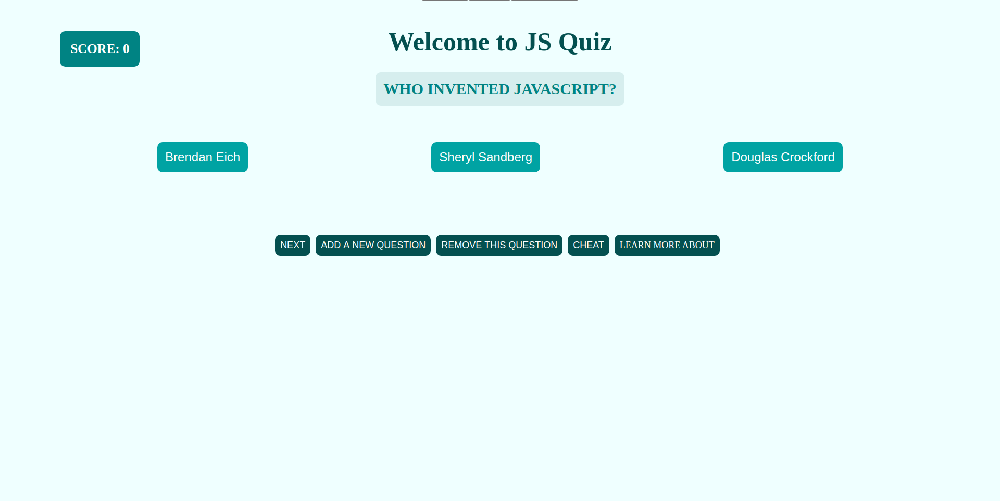

# Development Strategy

> `State week 1`

## State-project-js-quiz

Each step of the project has done in the collaboration. In this project main focus on three golden rules: Firstly, communicated with your group mates for each step. Secondly, improve the knowledge of the Git and Github for Merging, Pull request and Conflicts. Finally, improve  the javascript skills based on the DOM and Fundamental.

## Wireframe

## 0. Set-Up

_A User can see my initial repository and live demo_

> Assigned to Mamé

### Repository

- Created a new repository from this [template](https://github.com/HackYourFutureBelgium/state-project-js-quiz)
- Clone the repository
- Write initial, basic README
- Add a wireframe
- Start the development strategy
- Prepare a project board
- Push the changes to GitHub
- Turn on GitHub Pages 

## 1. HTMl&STYLE

**As a site visitor, I want to see very a simple website so that I can understand how the website will looks like.**

> assigned to Mamé

### Repo

This user story has been developed through a branch called 'style-1'.

### HTML

- add header and section semantic tags

### CSS

- add background img
- align tags

### javascript

-Add event listener two show basic html

## 2.Add New Questions

**As a site visitor, I want to add a new question to the game  so that I can enjoy more playing quiz game.**

> assigned to Mamé

### Repo

This user story has been developed through a branch called 'addQuestion'.

### HTML

- Added an id to add new question button

### CSS

- Nothing has changed

### javascript

- Add event listener two add button to add new question
- Wrote a test for logic to add a new questions

## 3. Remove current question from the quiz

**As a site visitor, I can remove current question from the quiz so I can manage question list.**

> assigned to Pavel

### Repo

This user story has been developed through a branch called 'remove-current-question'
'.

### HTML

- Added an appropriate `script` tags for handler and logic functions

### CSS

- Nothing has changed

### javascript

- Add event listener for `Remove question` button
- Add appropriate handler and logic functions
- Wrote a test for logic to add a new questions

## 4. Generate question

**As a site visitor, I want to see every time a new question with related possible answers on it.**

> assigned to Iryna

### Repo

This user story has been developed through a branch called 'getQuestion'.

### HTML

- Added an id and date-set to the buttons with answers

### CSS

- styled the buttons and questions 

### javascript

- Add event listeners to the `START` and `NEXT` buttons
- Wrote handler `getNewQuestion`;

## 5. Show correct answer and score

**As a site visitor, I want to see either I chose the correct answer or no and i want to see my score.**

> assigned to Iryna

### Repo

This user story has been developed through a branch called 'Answers_Score'.

### HTML

- Added a div fto display info for user

### CSS

- styled the output for the end of the game

### javascript

- Add event listeners to the buttons with answers
- Wrote handler `showAnswers`;

## 6. Get a hint

**As a site visitor, I can get a hint for the certain quiz question by pressing a `Cheat` button **

> assigned to Pavel

### Repo

This user story has been developed through a branch called `cheating`
'.

### HTML

- Added an appropriate `script` tags for handler and logic functions

### CSS

- Nothing has changed

### javascript

- Add event listener for `Cheat` button
- Add appropriate handler and logic functions
- Wrote a test for logic to add a new questions
